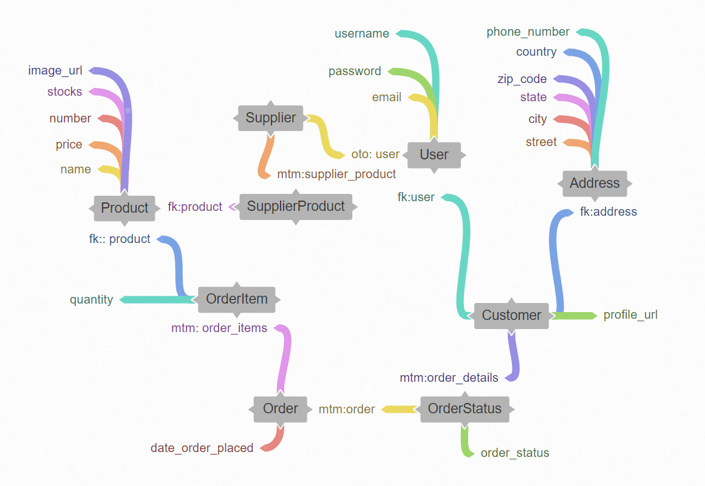

# Basic CRM 

***Install Requirements***

`pip install -r requirements.txt`

***urls***

- Client details

`http://127.0.0.1:8000/dashboard/client/`

- Quotations

`http://127.0.0.1:8000/dashboard`

***Database Design***

